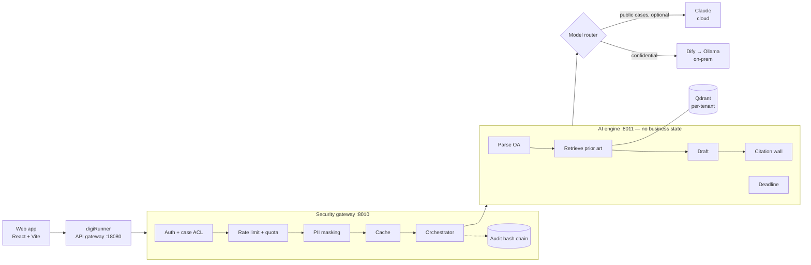

# CiteWall

> **Privacy-first AI assistant for Taiwan patent office-action (OA) responses**
>
> Student project — a GDG on Campus collaboration with TPIsoftware (NCCU GDGoC × Computex 2026)
>
> [繁體中文 README（主要）](README.md) · License: [Apache-2.0](LICENSE) · Security: [SECURITY.md](SECURITY.md)

An attorney uploads an Office Action. CiteWall **classifies the rejections, retrieves prior art,
drafts the response and computes the statutory deadline** — and the attorney reviews and signs
off every sentence before anything can be exported.

## Why "CiteWall"

The biggest risk in legal AI is a **fabricated citation** — citing the wrong statute or a
non-existent reference is a professional-liability event. So there is a **wall** between the LLM
and the attorney: every citation in a draft must map to a source that was actually retrieved,
or it is stripped and flagged. **The LLM never gets the final say.**

## What it solves

| Law-firm pain | How CiteWall handles it |
|---|---|
| OA responses are mostly manual | Parses the OA, retrieves prior art, drafts the response |
| AI can fabricate citations | Citation wall: deterministic check + sentence alignment + attorney sign-off |
| Client data must not leak | PII masked before any model call; confidential cases stay on on-prem models |
| A missed deadline forfeits rights | Multi-jurisdiction deadline engine (TW, US, JP, EP, CN, KR) with its reasoning shown |
| Incidents must be traceable | One audit row per request, in a tamper-evident hash chain |

## Architecture



Three rules, enforced by tests:

1. **The gateway never calls a model directly** — all inference goes through the AI engine.
2. **Mask before inference** — PII and client identifiers become placeholders before leaving the gateway; the mapping table never leaves the premises.
3. **Every request writes one audit row** — success, cache hit or error alike.

**Live-verified (2026-06-11):** web app → digiRunner → gateway → AI engine → Dify → Ollama
(`qwen2.5:7b`), about 25–28 s per full analysis.

## How the citation wall works

| Layer | What it does | What it stops |
|---|---|---|
| 1. Hard wall | Every citation must match a retrieved reference, or a statute quoted in the OA itself | Fabricated patent numbers, cases, statutes |
| 2. Sentence alignment | Checks each sentence against the passage it cites | Real citation, unsupported claim |
| 3. Attorney sign-off | Stripped or unsupported sentences cannot be accepted as-is; every sentence needs a decision before export | Whatever slips past layers 1–2 |

A verifier model gives a second opinion only; **whether a citation is valid is decided by
deterministic code**, so even a prompt-injected verifier cannot let a fabricated citation through.

## Quickstart

No API keys needed — runs on a mock model by default.

```bash
# One-click demo: backend + frontend + sample data, secrets auto-generated
bash scripts/start_demo.sh          # open http://localhost:5173

# End-to-end check (should print ALL CHECKS PASSED)
bash scripts/verify.sh

# Full delivery stack: Docker infra + digiRunner + Dify (real model)
bash scripts/start_delivery.sh
```

Requires Python 3.13 and Node 24. Demo passwords are `demo-<user>` (e.g. `demo-alice`).

## Try it

| To see | Do this | You'll see |
|---|---|---|
| Citation wall | Run an analysis, click a citation in the draft | Source patent and text; unverified citations shown as removed |
| PII masking | Click "Preview redaction" | Emails, phones and case numbers replaced by placeholders |
| Case access control | Log in as `carol`, analyze CASE-2025-001 | 403 — she is not on that case |
| Confidential routing | Use a case id ending in `-CONF` | The audit row shows the on-prem model |
| Audit chain | Log in as `audit_dave`, open Audit | "Verify hash chain" turns green |

| Account | Role | Use |
|---|---|---|
| `alice` | attorney | analyze, sign off |
| `bob` | paralegal | assist drafting |
| `carol` | IT admin | dashboards, case registry |
| `audit_dave` | auditor | review and verify the audit chain |

## Tech stack

**Frontend** React 19 · Vite 8 · Tailwind 4 · TanStack Query · zh-TW / EN · dark mode
**Backend** FastAPI · Qdrant (hybrid retrieval) · Redis · PostgreSQL · MinIO (WORM archive) · Keycloak (OIDC)
**AI** Dify · Ollama (on-prem) · Claude (cloud, optional for public cases) · PaddleOCR-VL (on-prem OCR)
**Gateway** digiRunner (TPIsoftware's open-source API gateway)

## Prior art

CiteWall builds on two earlier projects:

| Prior art | What it did | What CiteWall adds |
|---|---|---|
| [shin-lee-patent-rag](https://github.com/Washyu0826/shin-lee-patent-rag) (2026-04) | Taiwan patent RAG Q&A: bge-m3 + HyDE + reranker, refuses to answer on low confidence, benchmarked on 100 TIPO patents | From "can it find it" to "can you trust the citation": deterministic citation wall, sentence alignment |
| shin-lee (2026-04 to 06, GDG on Campus collaboration) | OA-response POC: thick gateway, masking, audit chain, Dify + digiRunner integration | Multi-tenancy, distributed correctness, privacy hardening, and a full pre-release review |

## Status

This is a **proof of concept** — do not expose it beyond localhost without the hardening in
[SECURITY.md](SECURITY.md).

- **Tests** (2026-09-30): backend pytest 1678 passed; frontend vitest 73 passed, Playwright 97 passed
- **Known issues and fix status**: [`docs/SECURITY_AUDIT.md`](docs/SECURITY_AUDIT.md)
- **Not done yet**: production SAML IdP, database streaming replication, per-tenant keys, incremental audit verification; deadline rules not yet reviewed by a patent attorney

## Documentation

| To understand | Read |
|---|---|
| Why it is designed this way | [`docs/DECISIONS.md`](docs/DECISIONS.md), [`docs/QUESTIONS.md`](docs/QUESTIONS.md) |
| Which code implements each decision | [`docs/ARCHITECTURE.md`](docs/ARCHITECTURE.md) |
| Security self-audit and known issues | [`docs/SECURITY_AUDIT.md`](docs/SECURITY_AUDIT.md) |
| Deploying and running the full stack | [`docs/DELIVERY_RUNBOOK.md`](docs/DELIVERY_RUNBOOK.md) |
| Development history and handoff | [`HANDOFF.md`](HANDOFF.md), [`CLAUDE.md`](CLAUDE.md) |

## License

[Apache License 2.0](LICENSE). See [CONTRIBUTING.md](CONTRIBUTING.md) to contribute.

> **Data note:** every case in `data/cases/` is synthetic. Never commit real, unpublished client
> matters or personal data — that is exactly the problem this project exists to solve.
