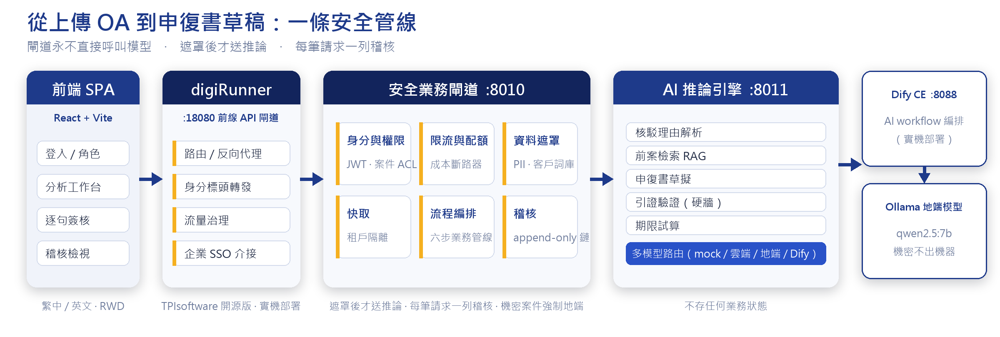
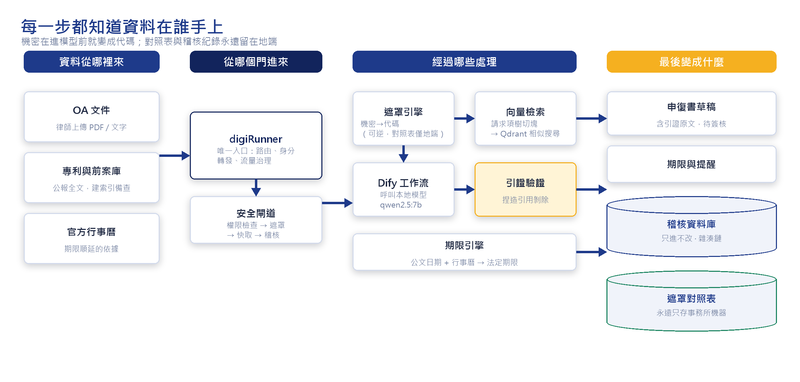

# CiteWall   


[](https://opensource.org/licenses/Apache-2.0)

> **台灣專利審查意見（OA）答辯的隱私優先 AI 助手**
>
> 學生作品 — 與 TPIsoftware（昕力資訊）合作的 GDG on Campus 專案（NCCU GDGoC × Computex 2026）
>
> [English README](README.en.md) ｜ 授權：[Apache-2.0](LICENSE) ｜ 安全回報：[SECURITY.md](SECURITY.md)

律師上傳審查意見（OA），CiteWall 會自動**分析核駁理由、找出前案、起草申復書、算出法定期限**；

律師逐句審核、簽核後才能匯出。

## 為什麼叫 CiteWall

法律 AI 最大的風險是**捏造引用**——引錯一個法條或前案，就是專業責任事故。
所以我們在 LLM 和律師之間築一道**引用牆**：草稿中的每個引用都必須對應到真的檢索到的來源，
對不上就移除並標出來。**LLM 永遠不是最後的裁判。**

## 解決什麼問題

| 律師事務所的痛點 | CiteWall 的做法 |
|---|---|
| 答辯大多是人工作業，費時 | 自動解析 OA、檢索前案、起草申復書 |
| AI 可能捏造引用 | 引用牆：確定性驗證 + 逐句對齊 + 律師簽核 |
| 客戶資料不能外流 | 個資先遮罩再送模型；機密案件只走地端模型 |
| 期限算錯就失權 | 多國期限引擎（台、美、日、歐、中、韓），附計算依據 |
| 出事要能追查 | 每個請求一筆稽核紀錄，雜湊鏈防竄改 |

## 一、系統架構



三條設計原則，由測試強制守住：

1. **閘道永遠不直接呼叫模型**——所有 AI 推論都經過 AI 推論引擎。
2. **遮罩之後才送推論**——個資和客戶識別碼在離開閘道前就換成代碼，對照表只存在地端。
3. **每個請求都寫一筆稽核**——成功、快取命中、失敗都一樣。

## 二、資料流



**實機驗證（2026-06-11）**：前端 → digiRunner → 閘道 → AI 推論引擎 → Dify → Ollama（qwen2.5:7b），
一次完整分析約 25–28 秒。

## 三、運作機制

| 層 | 做什麼 | 擋下什麼 |
|---|---|---|
| 1. 引用硬牆 | 每個引用都要對應到檢索到的前案，或 OA 本身引述的法條 | 捏造的專利號、判例、法條 |
| 2. 逐句對齊 | 檢查每句話和它引用的段落是否真的相符 | 引用是真的，但內容對不上 |
| 3. 律師簽核 | 被移除或對不上的句子不能直接接受；每句都要決定才能匯出 | 前兩層漏掉的 |

驗證模型只提供參考意見；**「引用是否有效」完全由確定性的程式決定**，即使驗證模型被 prompt injection 攻擊，也放不進捏造的引用。


## 四、權限設定

| 帳號 | 角色 | 用途 |
|---|---|---|
| `alice` | 律師 | 分析、簽核 |
| `bob` | 助理 | 協助擬稿 |
| `carol` | IT 管理員 | 儀表板、案件登錄 |
| `audit_dave` | 稽核員 | 查看與驗證稽核鏈 |


| 想看什麼 | 怎麼做 | 會看到 |
|---|---|---|
| 引用牆 | 分析後點草稿中的引用 | 來源專利和原文；沒通過驗證的引用顯示為已移除 |
| 個資遮罩 | 分析頁按「預覽 redaction」 | email、電話、案號被換成代碼 |
| 案件權限 | 用 carol 登入，分析 CASE-2025-001 | 被拒（403），她不在這個案件名單 |
| 機密路由 | 案號結尾改成 `-CONF` 再分析 | 稽核紀錄的模型變成地端模型 |
| 稽核鏈 | 用 audit_dave 登入，進稽核頁 | 按「驗證 hash chain」顯示綠燈 |

### 快速開始

不需要任何 API key，預設使用 mock 模型。

```bash
# 一鍵 demo：後端 + 前端 + 範例資料，自動產生金鑰
bash scripts/start_demo.sh          # 開啟 http://localhost:5173

# 驗證整條流程（應印出 ALL CHECKS PASSED）
bash scripts/verify.sh

# 完整交付版：Docker 基礎設施 + digiRunner + Dify（真模型）
bash scripts/start_delivery.sh
```

需求：Python 3.13、Node 24。登入密碼為 `demo-帳號`（例如 `demo-alice`）。


## 五、技術棧

- **前端 :** React 19 · Vite 8 · Tailwind 4 · TanStack Query · 繁中/英文 · 深色模式

- **後端 :** FastAPI · Qdrant（混合檢索）· Redis · PostgreSQL · MinIO（WORM 封存）· Keycloak（OIDC）

- **AI :** Dify · Ollama（地端）· Claude（雲端，一般案件可選用）· PaddleOCR-VL（地端 OCR）

- **閘道 :** digiRunner（TPIsoftware 開源 API 閘道）

## 六、前作與研究（Prior Art）

CiteWall 不是從零開始，它建立在兩個先前的專案之上：

| 前案 | 做了什麼 | CiteWall 延伸了什麼 |
|---|---|---|
| [shin-lee-patent-rag](https://github.com/Washyu0826/shin-lee-patent-rag)（2026-04） | 台灣專利 RAG 問答：bge-m3 + HyDE + reranker，信心不足時拒答，並以 100 篇 TIPO 專利做對照實驗 | 從「找得到」走向「引用可信」：確定性引用硬牆、逐句對齊 |
| shin-lee（2026-04～06，GDG on Campus 合作） | OA 答辯系統 POC：厚閘道、遮罩、稽核鏈、Dify 與 digiRunner 串接 | 多租戶、分散式正確性、隱私強化，以及公開發布前的全面審查 |

## 七、開發階段

這是**概念驗證（POC）**，未完成 [SECURITY.md](SECURITY.md) 的強化前，請勿對外開放。

- **測試**（2026-09-30）：後端 pytest 1678 passed；前端 vitest 73 passed、Playwright 97 passed
- **已知問題與修正狀態**：[`docs/SECURITY_AUDIT.md`](docs/SECURITY_AUDIT.md)
- **還沒做的**：正式 SAML IdP、資料庫即時複寫、每租戶獨立金鑰、稽核增量驗證
## 八、文件導覽

| 想了解 | 看這份 |
|---|---|
| 為什麼這樣設計 | [`docs/DECISIONS.md`](docs/DECISIONS.md)、[`docs/QUESTIONS.md`](docs/QUESTIONS.md) |
| 每個決策對應哪段程式 | [`docs/ARCHITECTURE.md`](docs/ARCHITECTURE.md) |
| 安全自審與已知問題 | [`docs/SECURITY_AUDIT.md`](docs/SECURITY_AUDIT.md) |
| 部署與起停 | [`docs/DELIVERY_RUNBOOK.md`](docs/DELIVERY_RUNBOOK.md) |
| 開發史與接手 | [`HANDOFF.md`](HANDOFF.md)、[`CLAUDE.md`](CLAUDE.md) |

## 九、授權

[Apache License 2.0](LICENSE)。參與貢獻請見 [CONTRIBUTING.md](CONTRIBUTING.md)。

> **資料說明**：`data/cases/` 內的案件全部是合成資料。請勿 commit 任何真實、未公開的客戶案件或可識別個資——這正是本專案要解決的問題。
